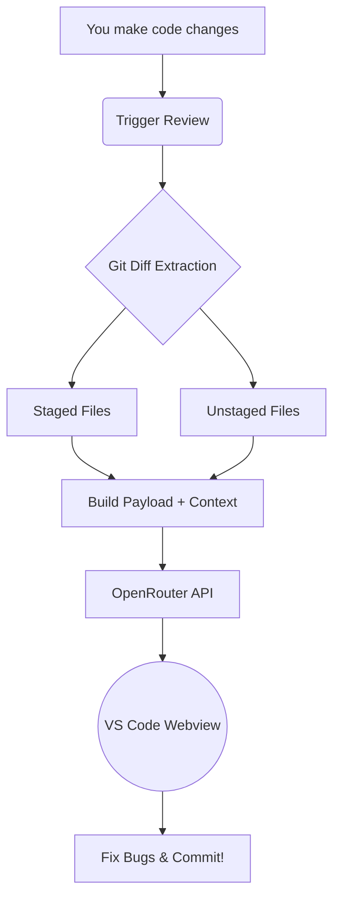

  
  <h1>CommitLens: AI-Powered Code Review Agent 🚀</h1>
  
<strong>A pedantic, strictly deterministic AI that ruthlessly catches your bugs before you commit.</strong>

---

**CommitLens** is a next-generation code review assistant built directly into your VS Code environment. It seamlessly analyzes your staged and unstaged Git changes, catches architectural flaws, and provides actionable code fixes right inside your editor.

## ✨ Key Features

- **The "Goldilocks" Diff Context:** Unlike other AI tools that hallucinate missing variables, CommitLens intelligently extracts the exact function you are modifying *plus* a 20-line padding zone (`git diff -U20 -W`). The AI gets perfect context without wasting tokens on unmodified code.
- **Strictly Deterministic Logic:** The AI is locked to `temperature: 0` and is strictly forbidden from outputting conversational filler, guaranteeing you get clean, noise-free bug reports 100% of the time.
- **Anti-Pedantry Guardrails:** The AI has been explicitly trained to prioritize high-impact bugs (SQL injection, runtime crashes, N+1 queries) and is forbidden from nagging you about valid conventions like SemVer shorthand.
- **Bring Your Own Model (BYOM):** Connect to OpenRouter and use any model you prefer—from `anthropic/claude-3.5-sonnet` to free open-source models.
- **Configurable API Limits:** Easily cap the maximum number of issues reported per review (e.g., Top 10) to save API credits and stay focused.

---

## 🛠️ How It Works

CommitLens operates fully locally within your editor before bridging to OpenRouter for the analysis phase. 

---

## 🚀 Quick Start Guide

Follow these steps to get your AI reviewer running in under 60 seconds:

### 1. Installation & Updates
Install the **CommitLens** extension from the VS Code Marketplace.

> [!NOTE]
> **Updating the Extension:** VS Code usually updates extensions automatically in the background. However, if you notice you don't have the latest features (like the new Toast Notifications or Configurable Issue Limits), you may need to update manually. Go to the **Extensions tab** in VS Code, search for **CommitLens**, and click the **Update** button if it is available.

### 2. Get an API Key
CommitLens routes all AI requests through OpenRouter to give you access to thousands of models. 
- Go to [OpenRouter.ai](https://openrouter.ai/) and create a free account.
- Generate an API Key in your account settings.

### 3. Configure the Extension
CommitLens provides two configuration pathways for flexibility and security:

**Method 1: Interactive UI Configuration (Recommended)**
1. Open the Command Palette (`Ctrl+Shift+P` on Windows/Linux, `Cmd+Shift+P` on macOS).
2. Execute the command: **`CommitLens: Open Review Panel`**.
3. Within the CommitLens panel, locate and select the **Profile Icon** situated in the top right corner.
4. Select **Update API Key** and securely input your OpenRouter API key. (Note: Keys are encrypted and securely stored within the native VS Code SecretStorage vault).
5. Select **Update Model ID** to specify your designated language model.

**Method 2: VS Code Workspace Settings**
Alternatively, the Model ID can be configured globally or per-workspace by navigating to the VS Code Settings (`Ctrl+,`) and searching for `CommitLens`. 
*Security Note: To prevent unintentional exposure in configuration files, the OpenRouter API Key must be managed exclusively through the interactive UI method described above.*

**Recommended Models:**
- `anthropic/claude-3-haiku` (Optimized for high-speed, low-latency reviews)
- `anthropic/claude-3.5-sonnet` (Optimized for deep architectural analysis and complex reasoning)

### 4. Trigger a Review!
Make a change to any file in your project. Open the CommitLens panel and click the giant **Trigger Review** button. The AI will instantly analyze your diff and output the results!

---

## 🧠 Customizing the AI's Brain

Want the AI to focus specifically on Security? Or maybe React performance? You have full control. Simply modify the core instruction set located in the repository at:
`docs/Skill.md`

The AI will dynamically adapt to the exact architectural guidelines you write in this markdown file.

---

## 🔒 Security & Privacy

* **Encrypted API Keys:** Your OpenRouter API key is stored securely in your machine's native keychain via VS Code's `SecretStorage` vault. It is never transmitted anywhere except directly to OpenRouter.
* **Usage Analytics:** CommitLens logs basic review metadata to a dedicated Supabase instance to help track coding velocity.

   
  <i>Built with ❤️ for developers who care about flawless code quality.</i>

